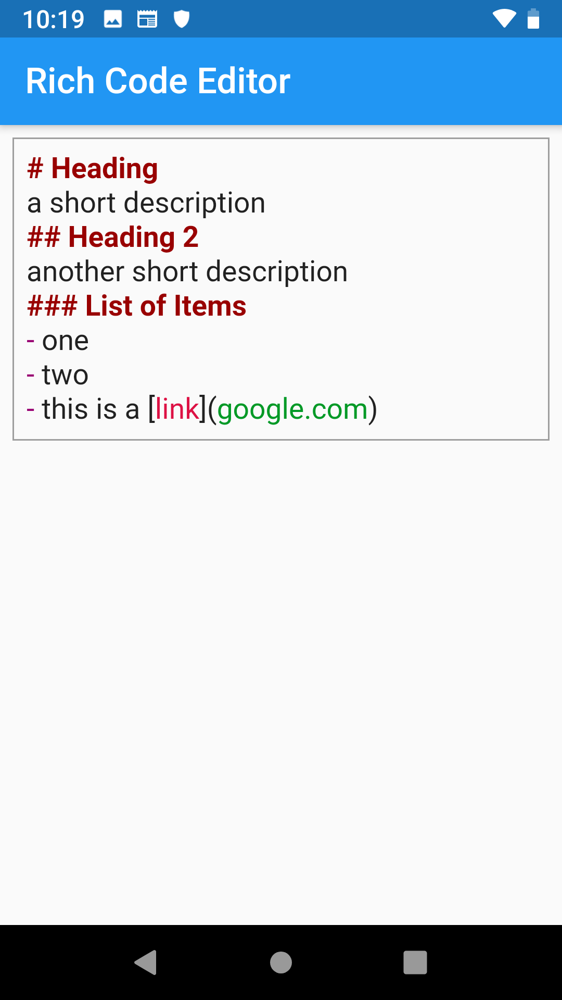
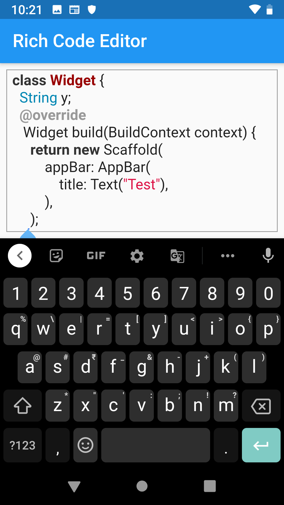

# creamy_field

A Text Editing Field with rich text & syntax highlight support. Useful in Rich text editors.

## Getting Started

### The main components of this package:

1. CreamyTextField
1. CreamyEditingController
1. Syntax Highlighter

The CreamyTextField is a text widget similar to Flutter's `TextField` widget. However, unlike a regular `TextField`
the editor supports a syntax highlighter and a controller which provides more description about a text.

You can also use a limited support for many programming languages & themes using CreamySyntaxHighlighter.

Since the text field itself is independent of the syntax highlighting rules, the same text field can be used for any other programming or markup langugage.
Only the syntax highlighter implementation needs to be created separately for each new programming language.

<!-- ## Previews from example

 -->

Based on [rich_code_editor](https://github.com/psovit/rich_code_editor/)
